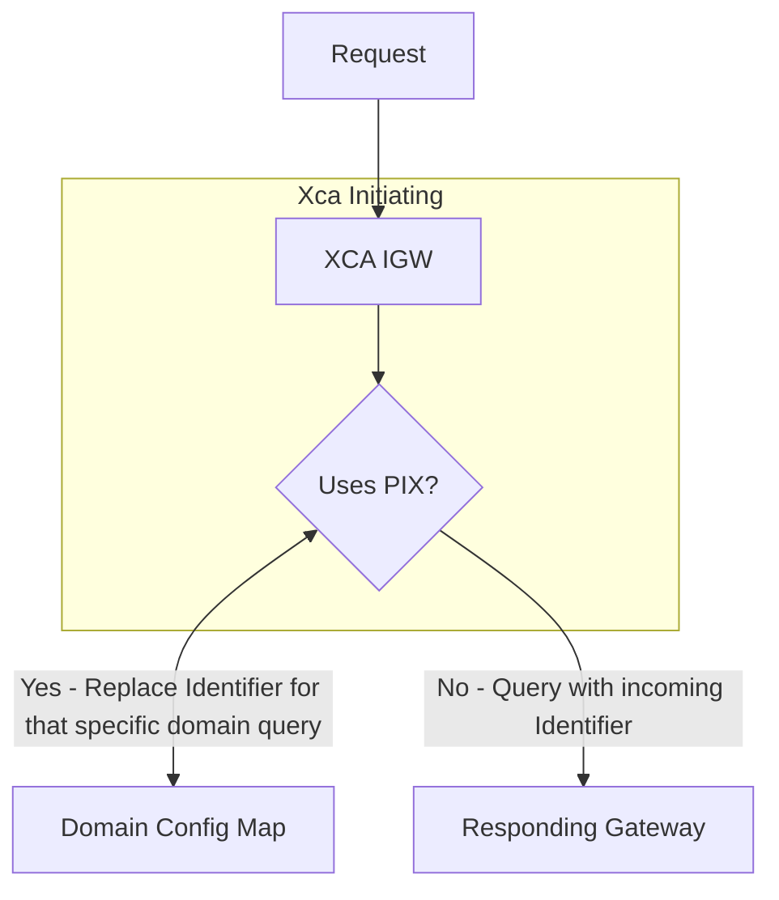

# Patient Identity Management

**XcaInteropService** has functionality for querying Responding Gateways with Domain-specific identifiers, if known. The Domain Config Map contains fields for specifying whether a domain should be queried with the incoming request identifier or the Domain-specific identifier

