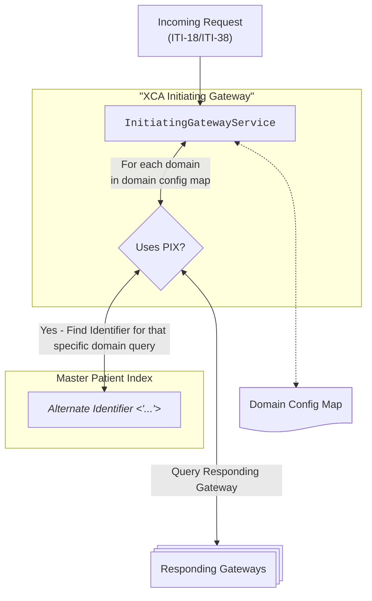

# Patient Identity Management

**XcaInteropService** has functionality for querying **Responding Gateways** with Domain-specific identifiers, if known. The **Domain Config Map** contains fields for specifying whether a domain should be queried with the incoming request identifier or the Domain-specific identifier.

## Usage of Patient Identities during Cross-Gateway Query
When a **Query Request** (ITI-38/ITI-18) is sent to the **Initiating Gateway**, the query is forwarded to all configured **Target Domains**. For each domain, the **Initiating Gateway**, coupled with the **PIX Manager** and **Domain Config**, determines whether the **Target Domain/Responding Gateway** should be queried using **Patient Identity Cross-Referencing (PIX)**.

If a **Responding Gateway** is configured to use **PIX**, the **Initiating Gateway** attempts to find the **Local Patient Identifier (LPI)** associated with the specific **Responding Gateway**'s **HomeCommunityID** using the **Master Patient Index (MPI)**.  
If no **LPI** match is found for a **PIX**-enabled **Responding Gateway**, the Gateway is not contacted and simply skipped for the duration of the query. 

> ℹ️ **Also...**<br> Correct usage of **PIX** also yields performance overhead, as gateways which are not registered as having data on a specific patient are skipped and not contacted, avoiding unescesarry HTTP-requests.


*Flow for using PIX with domain-specific identifiers*

### Master Patient Index
A **Master Patient Index (MPI)** is a record of unique patient identifiers. **XcaInteropService** acts as a **Master Patient Index**, and can cross-reference incoming patient identifiers to other identifiers, like domain-specific identifiers for targeted querying of document metadata. 
Patient identifiers are sectioned into different types. depending on the usage
|Type|Value|Comment|
|--|--|--|
|**GPI**|Global Patient Identifier|Cross-community identifier issued by the **Master Patient Index (MPI)** or **PIX Manager**.<br>Used to link patient records across multiple domains.
|**LPI**|Local Patient Identifier|A patient identifier assigned by a single facility, domain. Only meaningful within its own assigning authority.
|**SSN**|Social Security Number|A unique, national identifier - used for matching, but not a medical-record identifier.
*Patient identifier types*

#### Patient identity registry table (Informative)
|Type|Example value|Domain|
|--|--|--|
|`GPI`|`769fe411-fe5b-ba1f-fcee-91fa-4f4c2c0024ab^^^&amp;2.16.578.1.12.4.5.100.1.15&amp;ISO`|**Assigning Authority - XcaInteropService**<br>2.16.578.1.12.4.5.200.3.1.10.5|
|`LPI`|`158a50fc-ab15^^^&amp;2.16.578.1.12.4.5.100.1.15&amp;ISO`|**Hospital 1**<br>2.16.578.1.12.4.5.100.1.15|
|`LPI`|`296ade03-cf55^^^&amp;2.16.578.1.12.4.5.100.1.16&amp;ISO`|**Hospital 2**<br>2.16.578.1.12.4.5.100.1.16|
|`SSN`|`13116900216^^^&amp;2.16.578.1.12.4.1.4.1&amp;ISO`|Any domain which is not **PIX** enabled|
*Example patient identity - a GPI with alternate patient identifiers*

### Example - AdhocQueryRequest
Example incoming `<AdhocQuery>` with a **Social Security Number** (SSN) as Patient ID. Note the `home` attribute set to `2.16.578.1.12.4.5.100.1.15`, defining the intended target domain for this request.
```xml
<AdhocQuery id="urn:uuid:14d4debf-8f97-4251-9a74-a90016b0af0d" 
    xmlns="urn:oasis:names:tc:ebxml-regrep:xsd:rim:3.0" 
    home="2.16.578.1.12.4.5.100.1.15">
    <Slot name="$XDSDocumentEntryPatientId">
        <ValueList>
            <Value>'13116900216^^^&amp;2.16.578.1.12.4.1.4.1&amp;ISO'</Value>
        </ValueList>
    </Slot>
</AdhocQuery>
```
*Incoming AdhocQuery with **Social Security Number PID** for homecommmunity `2.16.578.1.12.4.5.100.1.15`*

If this domain is **PIX**-enabled, the **Intiating Gateway** will use the **PIX Manager** to cross-reference the incoming **Patient Identifier** along with the assigning authorities defined in the query, and replace the identifier in the request for that specific domain query to reflect its local patient identifier.

```xml
<AdhocQuery id="urn:uuid:14d4debf-8f97-4251-9a74-a90016b0af0d" 
    xmlns="urn:oasis:names:tc:ebxml-regrep:xsd:rim:3.0"
    home="2.16.578.1.12.4.5.100.1.15">
    <Slot name="$XDSDocumentEntryPatientId">
        <ValueList>
            <Value>'158a50fc-ab15^^^&amp;2.16.578.1.12.4.5.100.1.15&amp;ISO'</Value>
        </ValueList>
    </Slot>
</AdhocQuery>
```
*Incoming AdhocQuery with SSN PID*