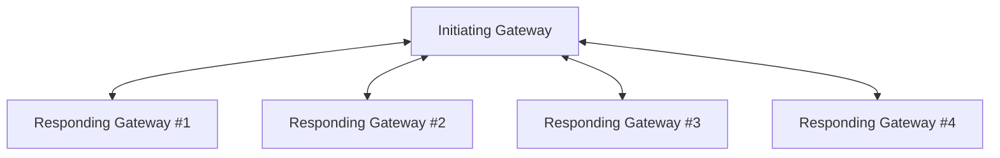

# XCA Initiating Gateway
An XCA Initiating Gateway accepts requests from a document consumer wishing to retrieve either document metadata or documents. The Initiating Gateway has a **Domain Config**, which defines a set of endpoints to query to retrieve metadata or documents. In IHE terminology, these are called **Affinity Domains** or **Communities**.

## Initiating and Responding Gateways
The Initiating Gateway is an actor that receives an initial request, and forwards it to all known Responding Gateways. 
